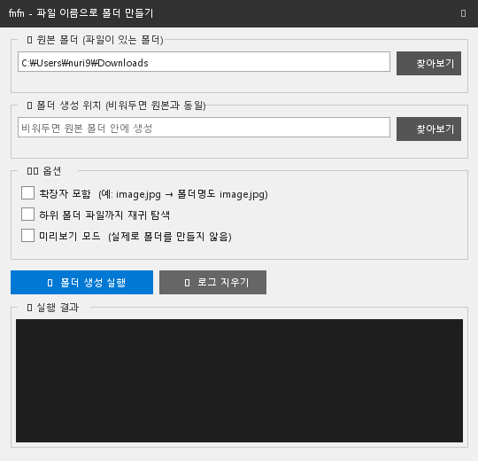
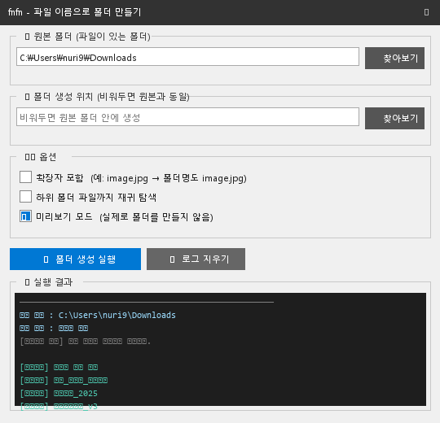
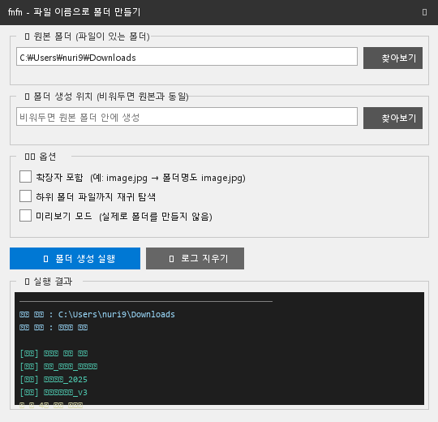

# fnfn — 파일 이름으로 폴더 만들기

> **F**older **N**ames **F**rom file **N**ames  
> 폴더 안의 파일 이름을 읽어서, 각 파일 이름과 동일한 **빈 폴더**를 자동으로 만들어주는 도구입니다.


---

## ✨ 기능

| 기능 | 설명 |
|------|------|
| 📂 원본 폴더 선택 | 파일이 있는 폴더를 지정합니다 |
| 📁 생성 위치 지정 | 폴더를 만들 위치를 따로 지정하거나, 비워두면 원본 폴더 안에 생성 |
| 🔤 확장자 포함/제거 | `image.jpg` → `image` (기본) 또는 `image.jpg` 그대로 |
| 🔁 재귀 탐색 | 하위 폴더의 파일까지 탐색 |
| 👁 미리보기 모드 | 실제로 만들지 않고 결과를 먼저 확인 |
| ✅ 중복 방지 | 이미 같은 이름의 폴더가 있으면 건너뜀 |

---

## 🖥 사용 방법

### GUI (더블클릭)

[Releases](https://github.com/lzpxilfe/folder-name-files-name/releases) 에서 `fnfn.exe`를 다운받아 더블클릭하면 바로 실행됩니다.

| 화면 | 설명 |
|------|------|
|  | 앱을 실행한 초기 상태 |
|  | 원본 폴더 경로 입력 |
|  | 미리보기 모드로 생성될 폴더 확인 |
|  | 폴더 생성 완료 |

### CLI (터미널)

```bash
# 기본 (확장자 제거)
python fnfn.py C:\Users\나\Downloads

# 확장자 포함
python fnfn.py C:\Users\나\Downloads --ext

# 다른 위치에 생성
python fnfn.py C:\Users\나\Downloads --output C:\Projects

# 실제 생성 전 미리보기
python fnfn.py C:\Users\나\Downloads --dry-run

# 하위 폴더 파일까지
python fnfn.py C:\Users\나\Downloads --recursive
```

#### 옵션 목록

| 옵션 | 단축키 | 설명 |
|------|--------|------|
| `--ext` | `-e` | 폴더 이름에 확장자 포함 |
| `--output DIR` | `-o` | 폴더를 생성할 경로 |
| `--dry-run` | `-n` | 미리보기만 (실제 생성 안 함) |
| `--recursive` | `-r` | 하위 폴더 파일까지 탐색 |

---

## 🛠 설치 / 실행

### 방법 1 — exe 실행 (Python 불필요)

바탕화면에 `fnfn.exe`를 두고 더블클릭

### 방법 2 — Python 직접 실행

```bash
# Python 3.8+ 필요, 별도 라이브러리 없음 (tkinter 내장)
python fnfn.py
```

---

## 📄 License

MIT
